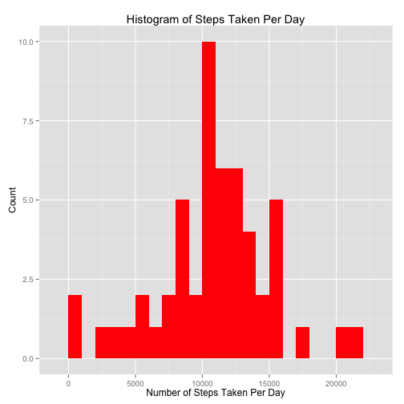
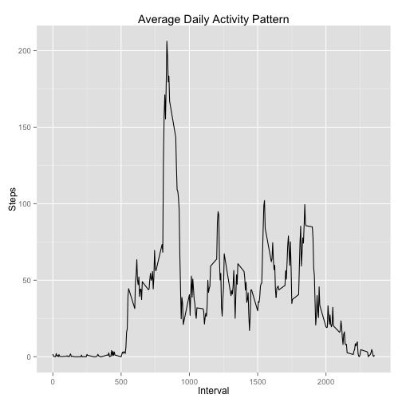
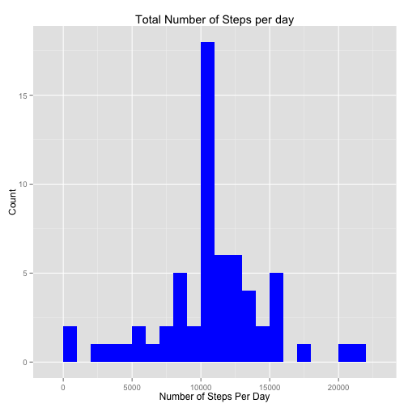
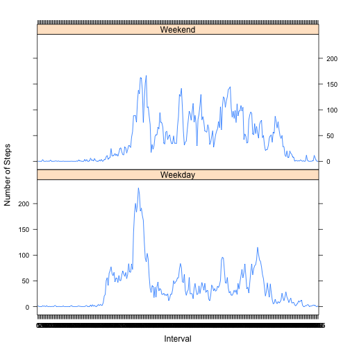

#Analyzing Quantified Self Data


###Load ggplot2 to create visualizations


```r
suppressWarnings(library(ggplot2))
```

```
## Find out what's changed in ggplot2 with
## news(Version == "1.0.1", package = "ggplot2")
```

```r
library(knitr)
```

First we will download and read the data into RStudio.


```r
url <- "https://d396qusza40orc.cloudfront.net/repdata%2Fdata%2Factivity.zip"
if(!file.exists("fitbit.zip")) {
  download.file(url, "fitbit.zip",method = "curl")
  unzip("fitbit.zip")
}
data <- read.csv("activity.csv", header = TRUE, colClasses = c("numeric","character","numeric"))
```


###Perform some preprocessing steps to the data


```r
data$date <- as.Date(data$date, format = "%Y-%m-%d")
data$interval <- as.factor(data$interval)
```


To get a general overview about the data, lets call summary on the dataset.


```r
summary(data)
```

```
##      steps             date               interval    
##  Min.   :  0.00   Min.   :2012-10-01   0      :   61  
##  1st Qu.:  0.00   1st Qu.:2012-10-16   5      :   61  
##  Median :  0.00   Median :2012-10-31   10     :   61  
##  Mean   : 37.38   Mean   :2012-10-31   15     :   61  
##  3rd Qu.: 12.00   3rd Qu.:2012-11-15   20     :   61  
##  Max.   :806.00   Max.   :2012-11-30   25     :   61  
##  NA's   :2304                          (Other):17202
```


###What is mean total number of steps taken per day?
There appears to be three different features of the dataset: steps, date and interval. We can start off by looking at some interesting things about the data. For example, lets first calculate the total number of steps per day.


```r
stepsByDay <- aggregate(steps~date, data, sum)
stepsByDay
```

```
##          date steps
## 1  2012-10-02   126
## 2  2012-10-03 11352
## 3  2012-10-04 12116
## 4  2012-10-05 13294
## 5  2012-10-06 15420
## 6  2012-10-07 11015
## 7  2012-10-09 12811
## 8  2012-10-10  9900
## 9  2012-10-11 10304
## 10 2012-10-12 17382
## 11 2012-10-13 12426
## 12 2012-10-14 15098
## 13 2012-10-15 10139
## 14 2012-10-16 15084
## 15 2012-10-17 13452
## 16 2012-10-18 10056
## 17 2012-10-19 11829
## 18 2012-10-20 10395
## 19 2012-10-21  8821
## 20 2012-10-22 13460
## 21 2012-10-23  8918
## 22 2012-10-24  8355
## 23 2012-10-25  2492
## 24 2012-10-26  6778
## 25 2012-10-27 10119
## 26 2012-10-28 11458
## 27 2012-10-29  5018
## 28 2012-10-30  9819
## 29 2012-10-31 15414
## 30 2012-11-02 10600
## 31 2012-11-03 10571
## 32 2012-11-05 10439
## 33 2012-11-06  8334
## 34 2012-11-07 12883
## 35 2012-11-08  3219
## 36 2012-11-11 12608
## 37 2012-11-12 10765
## 38 2012-11-13  7336
## 39 2012-11-15    41
## 40 2012-11-16  5441
## 41 2012-11-17 14339
## 42 2012-11-18 15110
## 43 2012-11-19  8841
## 44 2012-11-20  4472
## 45 2012-11-21 12787
## 46 2012-11-22 20427
## 47 2012-11-23 21194
## 48 2012-11-24 14478
## 49 2012-11-25 11834
## 50 2012-11-26 11162
## 51 2012-11-27 13646
## 52 2012-11-28 10183
## 53 2012-11-29  7047
```

Now we'll make a histogram of the steps per day.


```r
ggplot(stepsByDay, aes(steps)) + geom_histogram(fill = "red", bin = 1000) + ggtitle("Histogram of Steps Taken Per Day") + ylab("Count") + xlab("Number of Steps Taken Per Day")
```

 


Now, we'll calculate the mean and median of the total number of steps per day.


```r
meanStepsByDay <- mean(stepsByDay$steps, na.rm = TRUE)
medianStepsByDay <- median(stepsByDay$steps, na.rm = TRUE)
meanStepsByDay
```

```
## [1] 10766.19
```

```r
medianStepsByDay
```

```
## [1] 10765
```

It looks like the mean number of steps per day is 10766.19 and the median steps per day is 10765.


###What is the average daily activity pattern?

Make a time series plot of the 5-minute interval and the average number of steps taken, averaged across all days.


```r
steps_per_interval <- aggregate(data$steps, by = list(data$interval), mean, na.rm = TRUE)
colnames(steps_per_interval) <- c("interval","steps")
steps_per_interval$interval <-  as.integer(levels(steps_per_interval$interval)[steps_per_interval$interval])
ggplot(steps_per_interval, aes(x = interval, y = steps)) + geom_line(col = "black") + xlab("Interval") + ylab("Steps") + ggtitle("Average Daily Activity Pattern")
```

 

Now, we find the 5-minute interval that contains the maximum number of steps.


```r
index <- which.max(steps_per_interval$steps)
maxInterval <- steps_per_interval[index,]
maxInterval
```

```
##     interval    steps
## 104      835 206.1698
```
The 835th interval has the maximum number of steps with 206 steps.

###Imputing missing values

Calculate the total number of NA's in the dataset.

```r
sum(is.na(data$steps))
```

```
## [1] 2304
```


There are 2304 rows with NA's. We will replace the NA's with the median number of steps.


```r
imputedData <- data
for(i in 1:nrow(imputedData)) {
      if(is.na(imputedData$steps[i]) ==TRUE)
        imputedData$steps[i] <- steps_per_interval[which(imputedData$interval[i] == steps_per_interval$interval),]$steps
}
head(imputedData)
```

```
##       steps       date interval
## 1 1.7169811 2012-10-01        0
## 2 0.3396226 2012-10-01        5
## 3 0.1320755 2012-10-01       10
## 4 0.1509434 2012-10-01       15
## 5 0.0754717 2012-10-01       20
## 6 2.0943396 2012-10-01       25
```

Make a histogram of the total number of steps taken each day and calculate and report the mean and median total number of steps taken per day.


```r
imputedStepsPerDay <- aggregate(steps~date, imputedData, sum)
ggplot(imputedStepsPerDay, aes(steps)) + geom_bar(fill = "blue", bin = 1000) + ggtitle("Total Number of Steps per day") + xlab("Number of Steps Per Day") + ylab("Count")
```

 

```r
newMean <- mean(imputedStepsPerDay$steps)
newMedian <- median(imputedStepsPerDay$steps)
newMean
```

```
## [1] 10766.19
```

```r
newMedian
```

```
## [1] 10766.19
```
The mean and median of the new dataset are both 10766.19.

###Do these values differ from the estimages from the first part of the assignment?

They differ, but only by a slight amount. The mean's have not changed, however, the median of the imputed dataset is 1.19 higher than the dataset with NA's.

###What is the impact of imputing missing data on the estimates of the total daily number of steps?

As you can see from the analysis above, imputing the missing values had no affect on the mean value, but had shiften the mean value slightly. 

###Are there differences in activity patterns between weekdays and weekends?


```r
imputedData$date <- as.factor(weekdays(imputedData$date))
imputedData$dayOfWeek<- numeric(length = nrow(imputedData))
for (i in 1:nrow(imputedData)) {
      if(imputedData$date[i] %in% c("Saturday","Sunday")){
            imputedData$dayOfWeek[i] <- "Weekend"
           }
         else {
           imputedData$dayOfWeek[i] <- "Weekday"
           
         }
}
imputedData$dayOfWeek <- as.factor(imputedData$dayOfWeek)
avgSteps <- aggregate(imputedData$steps, by = list(interval = imputedData$interval, weekday = imputedData$dayOfWeek), FUN = "mean")
avgSteps$weekday <- as.factor(avgSteps$weekday)
levels(avgSteps$weekday) <- c("Weekday","Weekend")
names(avgSteps) <- c("interval","weekday","mean")
library(lattice)
```

```
## Warning: package 'lattice' was built under R version 3.1.3
```

```r
xyplot(avgSteps$mean ~ avgSteps$interval | avgSteps$weekday, layout = c(1,2), type = "l", xlab = "Interval", ylab = "Number of Steps")
```

 

As you can see, from the graph, it appears that people tend to take more steps on weekdays.


There seems to be some differences between weekdays and weekends. The plot shows that people tend to take more steps on weekdays than on weekends.


```r
knit2html("PA1_template.Rmd")
```

```
## 
## 
## processing file: PA1_template.Rmd
```

```
## 
  |                                                                       
  |                                                                 |   0%
  |                                                                       
  |..                                                               |   4%
##   ordinary text without R code
## 
## 
  |                                                                       
  |.....                                                            |   7%
## label: unnamed-chunk-15 (with options) 
## List of 1
##  $ echo: logi TRUE
## 
## 
  |                                                                       
  |.......                                                          |  11%
##   ordinary text without R code
## 
## 
  |                                                                       
  |.........                                                        |  14%
## label: unnamed-chunk-16 (with options) 
## List of 1
##  $ echo: logi TRUE
## 
## 
  |                                                                       
  |............                                                     |  18%
##   ordinary text without R code
## 
## 
  |                                                                       
  |..............                                                   |  21%
## label: unnamed-chunk-17 (with options) 
## List of 1
##  $ echo: logi TRUE
## 
## 
  |                                                                       
  |................                                                 |  25%
##   ordinary text without R code
## 
## 
  |                                                                       
  |...................                                              |  29%
## label: unnamed-chunk-18 (with options) 
## List of 1
##  $ echo: logi TRUE
## 
## 
  |                                                                       
  |.....................                                            |  32%
##   ordinary text without R code
## 
## 
  |                                                                       
  |.......................                                          |  36%
## label: unnamed-chunk-19 (with options) 
## List of 1
##  $ echo: logi TRUE
## 
## 
  |                                                                       
  |..........................                                       |  39%
##   ordinary text without R code
## 
## 
  |                                                                       
  |............................                                     |  43%
## label: unnamed-chunk-20 (with options) 
## List of 1
##  $ echo: logi TRUE
```

```
## 
  |                                                                       
  |..............................                                   |  46%
##   ordinary text without R code
## 
## 
  |                                                                       
  |................................                                 |  50%
## label: unnamed-chunk-21 (with options) 
## List of 1
##  $ echo: logi TRUE
## 
## 
  |                                                                       
  |...................................                              |  54%
##   ordinary text without R code
## 
## 
  |                                                                       
  |.....................................                            |  57%
## label: unnamed-chunk-22 (with options) 
## List of 1
##  $ echo: logi TRUE
```

```
## 
  |                                                                       
  |.......................................                          |  61%
##   ordinary text without R code
## 
## 
  |                                                                       
  |..........................................                       |  64%
## label: unnamed-chunk-23 (with options) 
## List of 1
##  $ echo: logi TRUE
## 
## 
  |                                                                       
  |............................................                     |  68%
##   ordinary text without R code
## 
## 
  |                                                                       
  |..............................................                   |  71%
## label: unnamed-chunk-24 (with options) 
## List of 1
##  $ echo: logi TRUE
## 
## 
  |                                                                       
  |.................................................                |  75%
##   ordinary text without R code
## 
## 
  |                                                                       
  |...................................................              |  79%
## label: unnamed-chunk-25 (with options) 
## List of 1
##  $ echo: logi TRUE
## 
## 
  |                                                                       
  |.....................................................            |  82%
##   ordinary text without R code
## 
## 
  |                                                                       
  |........................................................         |  86%
## label: unnamed-chunk-26 (with options) 
## List of 1
##  $ echo: logi TRUE
```

```
## 
  |                                                                       
  |..........................................................       |  89%
##   ordinary text without R code
## 
## 
  |                                                                       
  |............................................................     |  93%
## label: unnamed-chunk-27 (with options) 
## List of 1
##  $ echo: logi TRUE
```

```
## 
  |                                                                       
  |...............................................................  |  96%
##   ordinary text without R code
## 
## 
  |                                                                       
  |.................................................................| 100%
## label: unnamed-chunk-28 (with options) 
## List of 1
##  $ echo: logi TRUE
```

```
## output file: PA1_template.md
```
